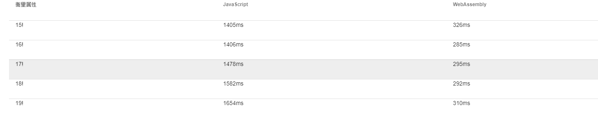

# electron-vue-demo
> 一个使用Vue+Vuetify+VueRouter+Vuex+WebAssembly+ThreeJS的案例


## 快速开始
```
https://github.com/ScarboroughCoral/electron-vue-demo.git
cd electron-vue-demo
yarn
yarn electron:serve
```

## WebAssembly 测试
- 阶乘计算
> 一次计算不太明显，每个阶乘计算了10e6次


## 安装依赖
```
yarn
```
## 运行与打包

- 开发模式
```
yarn run electron:serve
```

- 生产模式打包
```
yarn run electron:build
```

- Lints and fixes files
```
yarn lint
```

### 个性化配置
See [Configuration Reference](https://cli.vuejs.org/config/).
